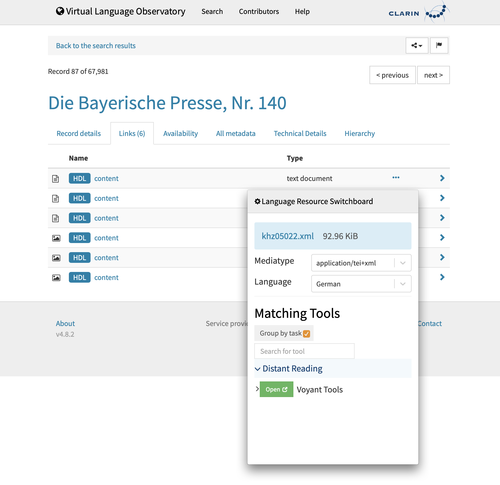
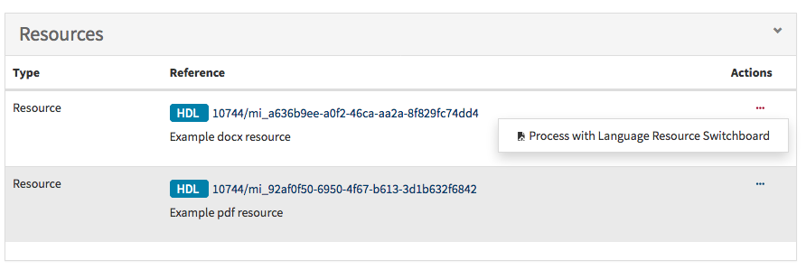
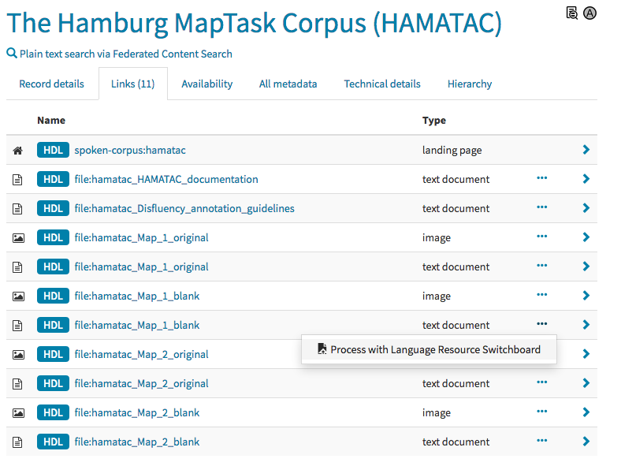

# Integrating a resource provider

There are two ways a resource provider can connect to the Switchboard:

1. by showing a Switchboard site popup integrated in the resource provider's
site

1. by redirecting the client (browser) to the Switchboard site


# 1. Integrated Switchboard popup

The Switchboard popup can be displayed when the user presses a button or link on
the integrator's repository site. The requirements are as follows:

* The repository site must include the Switchboard popup js file
(usually in the html header):
````html
    <script type="text/javascript"
            src="https://switchboard.clarin.eu/popup/switchboardpopup.js">
    </script>
````

* A button or other element that should display the Switchboard popup when
pressed must call the `showSwitchboardPopup` javascript function in the event
handler:

````javascript
showSwitchboardPopup(
    {alignSelector: '#id3b6', alignRight: true},
    {url: 'http://hdl.handle.net/10932/00-01B8-AF6C-BC6A-0601-D'}
);
````

The `showSwitchboardPopup` function has two parameters. The first specifies the
position of the popup in the html page, while the second specifies the resource
metadata to be sent to the Switchboard.

The first parameter must be an object with the following properties:
* `alignSelector` is mandatory and designates the selector for a page element
used to position the popup. The popup will be placed right under this element
and, by default, will be left-aligned with it.
* `alignRight` is optional and can be used to require a right-alignment of the
popup with the positioning element.

The second parameter must be an object with the following properties:
* `origin` is recommended and specifies a name or identifier of the calling
application. Currently used values are (non-exhaustive list): `vlo`, `vcr`,
`fcs`, `b2drop`, `d4science`.
* `url` is mandatory and specifies the actual data url
* `mimetype` is optional and specifies the media type (MIME type) of the resource
* `language` is optional and can specify the language of the resource as a
three letter language code ([ISO 639-3](https://iso639-3.sil.org/))

A full example of a HTML element with a Switchboard event handler:
````html
<li id="id3b6">
    <a href="javascript:;" onclick="
        showSwitchboardPopup({alignSelector:'#id3b6', alignRight:true},
            {url:'http://hdl.handle.net/10932/00-01B8-AF6C-BC6A-0601-D'});">
        <i class="glyphicon glyphicon-open-file" aria-hidden="true"></i>
        <span>Switchboard</span>
    </a>
</li>
````

The `origin` parameter can also be globally set by calling once the
`setSwitchboardConfig` javascript function. Other global configurations are:
- `switchboardURL` (optional) specifies which switchboard instance to use. It
is automatically set on initialisation based on the url of the Switchboard
popup js file, so it's not normally needed.
- `title` (optional) is the new title for the Switchboard popup. It is
recommended that it ends with "Switchboard", e.g. "CLARIN Switchboard".
- `origin` (optional) sets the origin parameter described above.

An example invocation could be:
````javascript
setSwitchboardConfig({origin: 'acme', title: 'ACME Switchboard'});
````

## Lookup Tools for text selection

The Switchboard popup can function in a "Lookup Tools" special mode. In this
mode the Switchboard popup is automatically displayed each time the user
selects a text fragment. If the selection consists of up to 3 words, the tools
presented to the user are dictionaries, gazetteers, encyclopedias and other
reference tools that could provide information on these words.

To enable this mode, the repository site must first include the Switchboard
popup js file as described in the preceding section. Currently you have to use
the beta version of the Switchboard to access this functionality:
````html
    <script type="text/javascript"
            src="https://beta-switchboard.clarin.eu/popup/switchboardpopup.js">
    </script>
````

The javascript function that must be called to enable this mode is
`showSwitchboardPopupOnSelection(align, params)`. It must be called once at the
**end** of the HTML file, like in this example (but please use a real
repository name for the `origin` field):

````html
    <script>showSwitchboardPopupOnSelection({}, {origin:'unknown'})</script>
````

This functionality can be also disabled by calling the
`disableSwitchboardPopupOnSelection()` function, without any parameters.


## User interface example

This is how the Switchboard popup looks like when integrated in the
[VLO](https://vlo.clarin.eu) repository:



# 2. Redirecting the client (browser) to the Switchboard site

A resource provider can connect to the Switchboard by redirecting the client
(browser) to the Switchboard site and providing specific information that serves
as input to the Switchboard's logic in doing so.

The following information can/has to be passed on to the Switchboard:

| Information | Description | Required? |
|-----|-----|-----|
| *origin* | Origin of the request - a name or identifier of the calling application | **Yes** |
| *uri* | Location or identifier of the potentially processable resource | **Yes** |
| *mimetype* | Media type (aka MIME type) of the potentially processable resource | No |
| *language* | Three letter language code ([ISO 639-3](https://iso639-3.sil.org/)) of the content language of the potentially processable resource | No |


### By HTTP POST

Send a HTTP POST request to the Switchboard by using a HTML form. The form must/can contain the call parameters described above.

In the example below the {switchboard base URL} could be
'https://switchboard.clarin.eu', which is the base url of the production
instance:

```html
<form action="{switchboard base URL}" method="POST" enctype="multipart/form-data" target="_blank">
    <!-- resource url, required -->
    <input type="text" name="url" value="{url}">
    <!-- origin, optional -->
    <input type="text" name="origin" value="{origin}">
    <!-- mimetype, optional -->
    <input type="text" name="mimetype" value="{mimetype}">
    <!-- language, optional -->
    <input type="text" name="language" value="{language}">

    <input type="submit" value="Submit">
</form>
```

### By HTTP GET with path parameters (deprecated)

**❗️This method of calling the Switchboard is deprecated and will be removed
in the future, please use the popup method or the HTTP POST method instead**

The URL pattern to use is:

```
{switchboard base URL}#/{origin}/{URI}[/{mimetype}[/{language}]]
```

* All values **have to be URL encoded**.
* For production, `{switchboard base URL}` is `https://switchboard.clarin.eu`
* An arbitrary identifying string for the calling service can be chosen for
`{origin}` (see above).

### Examples
* https://switchboard.clarin.eu/#/vlo/https%3A%2F%2Fwww.clarin.eu
* https://switchboard.clarin.eu/#/vlo/https%3A%2F%2Fwww.clarin.eu%2Fcmdi/application%2Fhtml
* https://switchboard.clarin.eu/#/vlo/http%3A%2F%2Fxmlns.com%2Ffoaf%2Fdoc%2FREADME.txt/text%2Fplain/eng

## User interface

The [VLO](https://vlo.clarin.eu) and [VCR](https://collections.clarin.eu) provide access to the switchboard through their resources listings.

### VCR
The VCR provides a drop down menu for each resource in the resources table of a collection. See for example [hdl:11372/VC-1002](http://hdl.handle.net/11372/VC-1002)


### VLO
Very much like the VCR, the VLO provides a drop down menu for each resource in the links section of a record page:


The VLO web app is implemented using [Apache Wicket](https://wicket.apache.org/). The UI part of the Switchboard connection is implemented in the [`ResourceLinksPanelItem`](https://github.com/clarin-eric/VLO/blob/master/vlo-web-app/src/main/java/eu/clarin/cmdi/vlo/wicket/panels/record/ResourceLinksPanelItem.java) class, where a [`LanguageResourceSwitchboardLink`](https://github.com/clarin-eric/VLO/blob/master/vlo-web-app/src/main/java/eu/clarin/cmdi/vlo/wicket/components/LanguageResourceSwitchboardLink.java) is instantiated.

## Video tutorial

On the [CLARIN ERIC Youtube channel](https://www.youtube.com/channel/UCJPks1mzisqsS4NrBFKIWag), you can find the video tutorial ["Connecting resource providers to the Language Resource Switchboard"](https://www.youtube.com/watch?v=YX5oGr949bQ).
